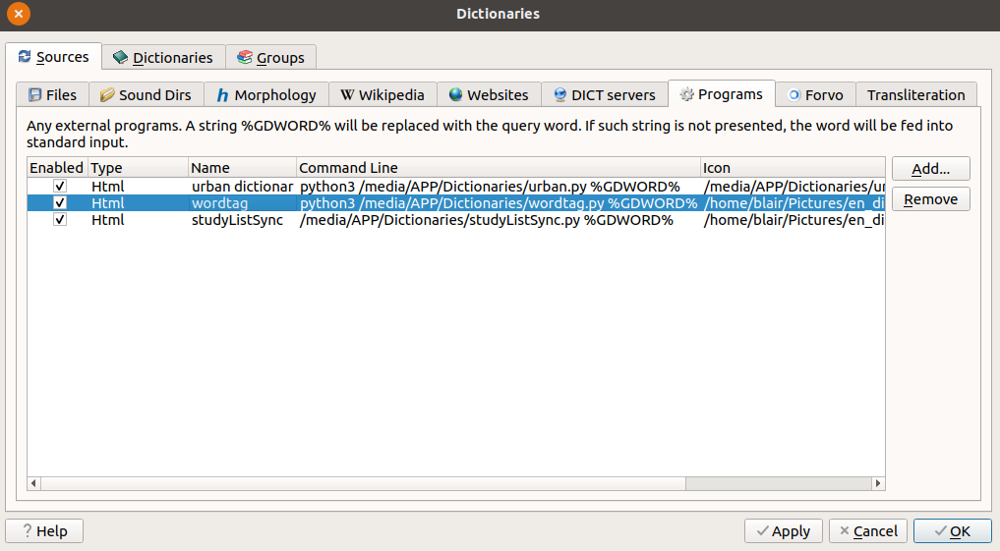
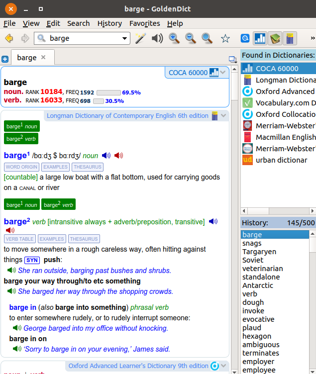
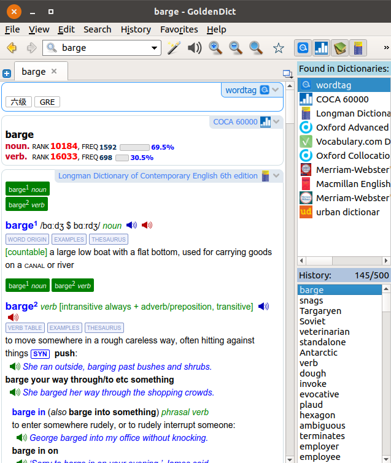

# spider
通过爬虫制作GoldenDict在线字典

在Linux平台写了个Python脚本，通过GoldenDict软件将查询词送入脚本，脚本将查询的单词传到欧陆词典在线网站，爬取欧陆在线词典网站的结果，用Beautifulsoup处理获得该单词对应的级别的信息，将其信息显示在GoldenDict软件中。

GoldenDict提供了外部程序接口，可以将查询单词送入程序

原来我的GoldenDict长这样

后来我的GoldenDict长这样(注意最上方，多出一个模块)

